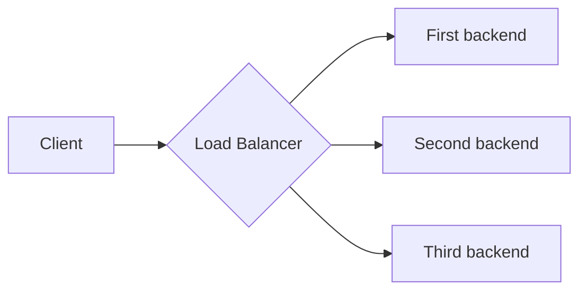

# Load balancer example
## Diagram

## Run with docker (Server)
```
# Change directory for copy dependencies.
cd ..

docker build -t test-lb -f example/Dockerfile .

docker run -p 3000:3000 test-lb
```

## Test with curl (Client)
```
# Response of "First" backend
$ curl -XPOST -d "" 127.0.0.1:3000/hello 
Hello First

# Response of "Second" backend
$ curl -XPOST -d "" 127.0.0.1:3000/hello 
Hello Second
```
